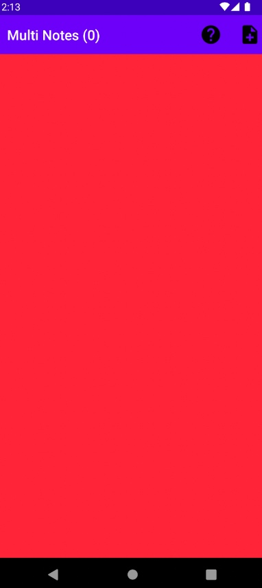
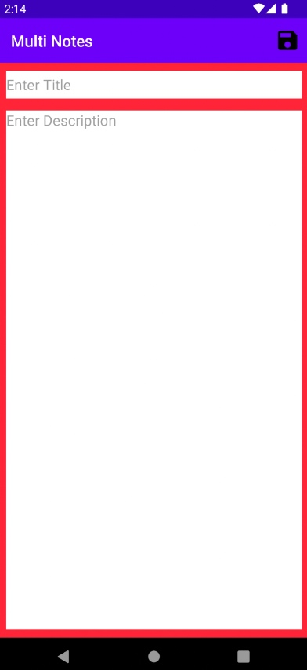
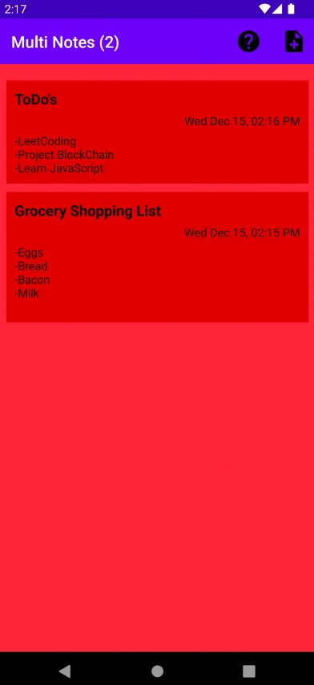
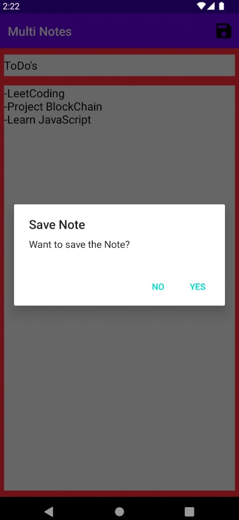
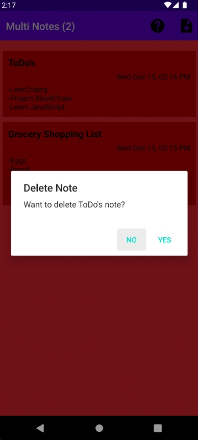
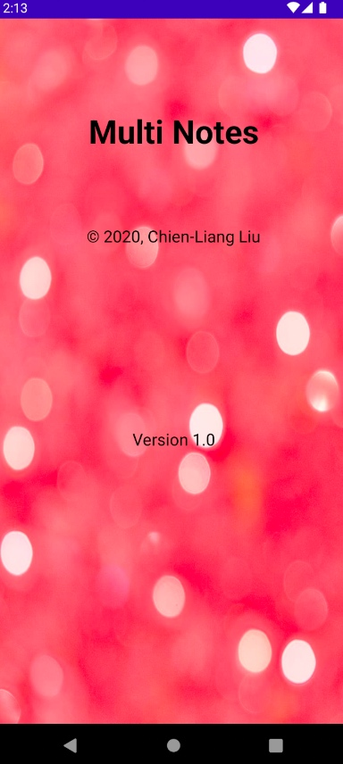

# NotePad
 
**Note Pad Andriod Application** (Android Studio) 

Mobile Application to add multiple notes and saved as persistence data via JSON. Date and time will be recorded as well when notes are added or saved. Notes are displayed in order on the Recycler View based on most recent created or saved note. 

**Features:**

-Add a new note (note will not be added if there is no title). Notes are displayed on the recycler view based on most recent added.  

 

 

-------------
-Pressing back key instead of save icon will display alert pop up.  

 

-------------
-Long press on note to delete  

 

-------------
-Tap on note to edit or update

 
-------------

-About Page (Question mark icon)   

 
NOTE: -Remove .gradle and build folder to build if error
